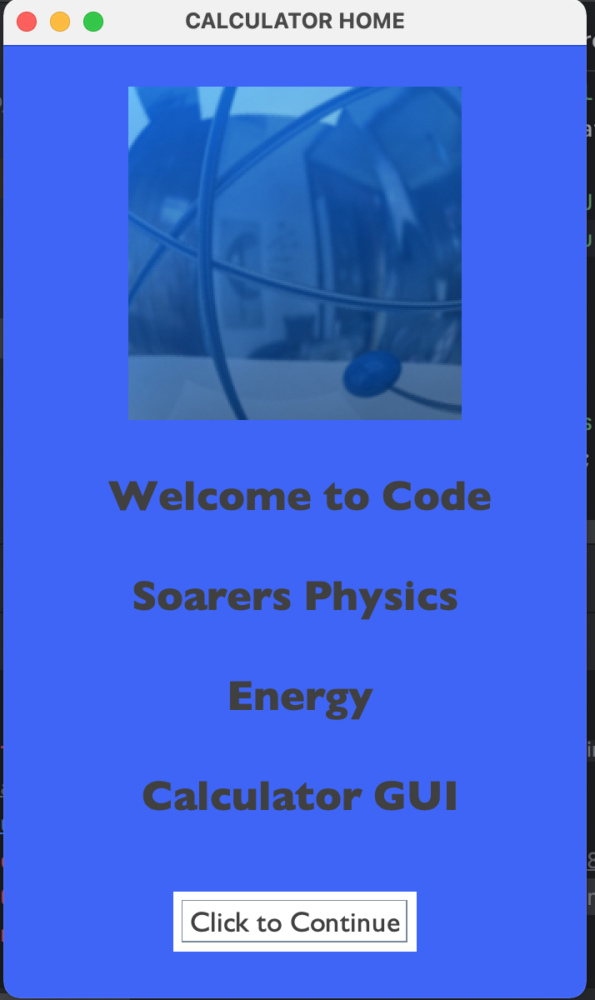
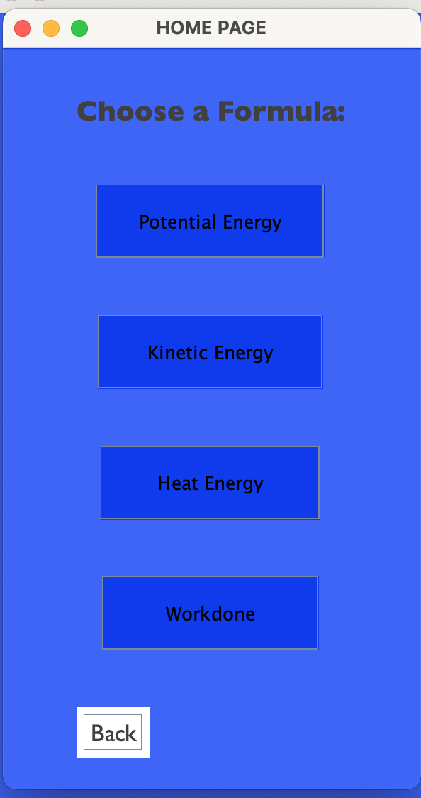
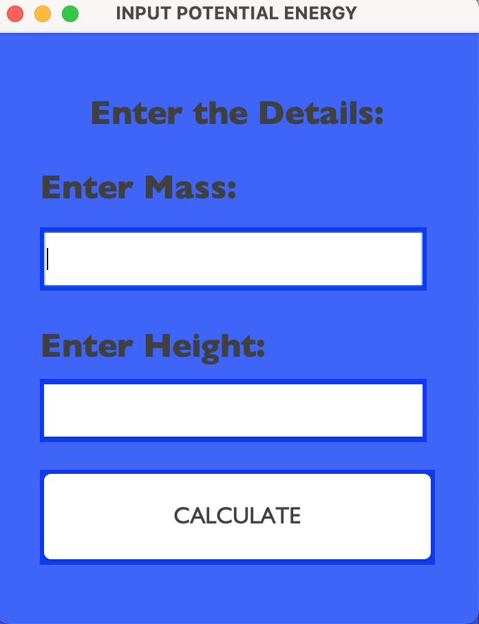

# CODE-SOARERS PHYSICS ENERGY CALCULATOR GUI/TERMINAL
-A calculator that performs energy calculations such as:
1. Potential UI.Energy
2. Kinetic UI.Energy
3. Heat UI.Energy
4. Nuclear UI.Energy
5. Workdone

The Program is in two mode:Graphical User Interface(GUI) and Terminal based on the user's choice.

# Screenshot

