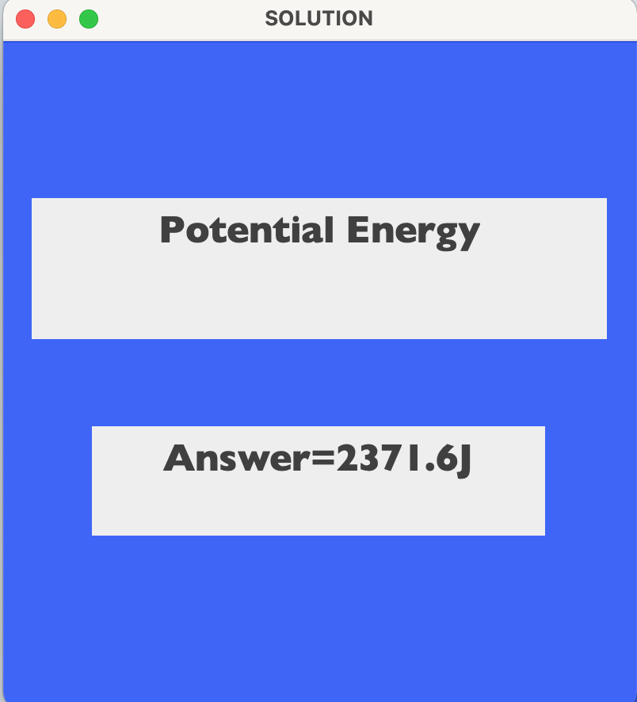

# CODE-SOARERS PHYSICS ENERGY CALCULATOR GUI/TERMINAL
This is a Java program that serves  both terminal and a UI (User Interface) calculator for different types of energy. It offers the user a choice of five different types of energy calculations to perform.
Below are the types of energy and their respective formulas:

1. Potential Energy: mass * acceleration due to gravity * height
2. Kinetic Energy: 1/2 * mass * velocity^2
3. Heat Energy:  mass of the substance * change in temperature * specific heat capacity 
4. Work Done: force * distance 
5. Nuclear Energy:mass * speed of light ^ 2

The program prompts the user to enter the type of mode to use whether terminal based or Graphical interface mode.In either cases, the user is asked to enter or click the energy they wish to calculate, and then prompts for the relevant inputs. It then calculates the energy based on the user's inputs and displays the result.

Overall, this program provides a simple and user-friendly way for someone to calculate different types of energy, without needing to perform the calculations manually or use a separate calculator.It uses the approach of Object Oriented Programming(OOP) to implement the program.

# Screenshot

